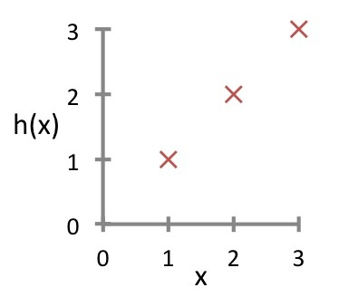

# Lecture Questions

## Week 1: Introduction

1. [Video 2][w1v2] at 2'36":

"A computer program is said to learn from experience E with respect to some 
task T and some performance measure P, if its performance on T, as measured 
by P, improves with experience E." - [Mitchell, T. 1997.][mitch97]

Suppose your email program watches which emails you do or do not mark as spam,
and based on that learns how to better filter spam. What is the task T in this
setting?

  a. Classifying emails as spam or not spam.
  b. Watching you label emails as spam or not spam.
  c. The number (or fraction) of emails correctly classified as spam/not spam.
  d. None of the above - this is not a machine learning problem.

2. [Video 3][w1v3] at 10'23":

You're running a company, and you want to develop learning algorithms to
address each of two problems.

Problem 1: You have a large inventory of identical items. You want to predict
how many of these items will sell over the next 3 months.

Problem 2: You'd like software to examine individual customer's accounts, and
for each account decide if it has been hacked/compromised.

Should you treat these as classification or as regression problems?

  a. Treat both as classification problems.
  b. Treat problem 1 as a classification problem, problem 2 as a regression problem.
  c. Treat problem 1 as a regression problem, problem 2 as a classification problem.
  d. Treat both as regression problems.

3. [Video 4][w1v4] at 12'24":

Of the following examples, which would you address using an unsupervised learning
algorithm? (Check all that apply.)

  a. Given email labeled as spam/not spam, learn a spam filter.
  b. Given a set of news articles found on the web, group them into a set of
     articles about the same story.
  c. Given a database of customer data, automatically discover market segments and
     group customers into different market segments.
  d. Given a dataset of patients diagnosed as either having diabetes or not, learn
     to classify new patients as having diabetes or not.

4. [Video 5][w1v5] at 4'38":

Consider the training set shown below. `(x^(i), y^(i))` is the i^th training example.

What is y^(3)?

    |  Size in feet^2 (x)  |  Price($) in 1000's (y)  |
    |----------------------|--------------------------|
    |        2104          |           460            |
    |        1416          |           232            |
    |        1534          |           315            |
    |         852          |           178            |

  a. 1416
  b. 1534
  c. 315
  d. 0

5. [Video 6][w1v6] at 2'12":

Consider the plot below of `h_theta(x) = theta_0 + theta_1 * x`. What are `theta_0` and
`theta_1`?

  

  a. `theta_0` = 0, `theta_1` = 1
  b. `theta_0` = 0.5, `theta_1` = 1
  c. `theta_0` = 1, `theta_1` = 0.5
  d. `theta_0` = 1, `theta_1` = 1

6. [Video 7][w1v7] at 6'52":

Suppose we have a training set with m=3 examples, plotted below. Our hypothesis
representation is `h_theta(x) = theta_1 * x`. The cost function `J(theta_1)` is
`J(theta_1) = ½m * sum(i = 1, m, (h_theta(x^i)−y^i)^2)`. What is `J(0)`?

  

  a. 0
  b. 1/6
  c. 1
  d. 14/6

7. [Video 9][w1v9] at 10'48":

Suppose `theta_0 = 1`, `theta_1 = 2`, and we simultaneously update `theta_0` and
`theta_1` using the rule:

    theta_j <= theta_j + sqrt(theta_0 * theta_1) (for j=0 and j=1)

What are the resulting values of `theta_0` and `theta_1`?

  a. 0
  b. 1/6
  c. 1
  d. 14/6

8. [Video 10][w1v10] at 8'04":

Suppose `theta_1` is at a local optimum of `J(theta_1)`, such as shown in the
figure. What will one step of gradient descent

    theta_1 <= theta_1 - alpha * (diff wrt theta_1) J(theta_1)

do?

  

  a. Leave `theta_1` unchanged
  b. Change `theta_1` in a random direction
  c. Move `theta_1` in the direction of the global minimum of `J(theta_1)`
  d. Decrease `theta_1`

9. [Video 11][w1v11] at 9'04":

Which of the following are true statements? Select all that apply.

  a. To make gradient descent converge, we must slowly decrease `alpha` over
     time.
  b. Gradient descent is guaranteed to find the global minimum for any function
     `J(theta_0, theta_1)`.
  c. Gradient descent can converge even if `alpha` is kept fixed. (But `alpha`
     cannot be too large, or else it may fail to converge.)
  d. For the specific choice of cost function `J(theta_0, theta_1)` used in
     linear regression, there are no local optima (other than the global optimum).

10. [Video 12][w1v12] at 2'26":

Which of the following statements are true? Select all that apply.

  a. [ 1 2 ]
     [ 4 0 ] is a 3 x 2 matrix.
     [ 0 1 ]

  b. [ 0 1 4 2 ]
     [ 3 4 0 9 ] is a 4 x 2 matrix.

  c. [ 0  4 2 ]
     [ 3  4 9 ] is a 3 x 3 matrix.
     [ 5 -1 0 ]

  d. [ 1 2 ] is a 1 x 2 matrix.

11. [Video 12][w1v12] at 4'55":

Let `A` be a matrix shown below. `A_32` is one of the elements of this matrix.

        [ 85 76 66  5 ]
    A = [ 94 75 18 28 ]
        [ 68 40 71  5 ]

What is the value of `A_32`?

  a. 18
  b. 28
  c. 76
  d. 40

12. [Video 13][w1v13] at 1'51":

What is

    [  8 6  9 ]     [  3 10  2 ]
    [ 10 1 10 ]  +  [  6  1 -1 ] ?

  a. [  5 -4  7 ]
     [  4  0 11 ]

  b. [ 11 16 11 ]
     [ 16  2  9 ]

  c. [ 14  7  8 ]
     [ 13 11 12 ]

  d. [  8  6  9 ]
     [ 10  1 10 ]

13. [Video 13][w1v13] at 4'01":

             [ 4 5 ]
What is  2 x [ 1 7 ] ?

  a. [ 8 10 ]
     [ 2 14 ]

  b. [ 8 5 ]
     [ 1 7 ]

  c. [ 8 10 ]
     [ 1  7 ]

  d. [ 4  5 ]
     [ 1 14 ]

14. [Video 13][w1v13] at 6'40":

         [ 4 ]        [ 2 ]
What is  [ 6 ] /2 - 3 [ 1 ]?
         [ 7 ]        [ 0 ]

  a. [ 4 ]
     [ 0 ]
     [ 5 ]

  b. [ -4 ]
     [ -1 ]
     [  3 ]

  c. [  -4 ]
     [   0 ]
     [ 3.5 ]

  d. [  0  ]
     [  2  ]
     [ 3.5 ]

15. [Video 14][w1v14] at 5'15":

Consider the product of these two matrices:

                   [ 1 ]
    [  1  2  1  5 ][ 3 ]
    [  0  3  0  4 ][ 2 ]
    [ -1 -2  0  0 ][ 1 ]

What is the dimension of the product?

  a. 3 x 1
  b. 3 x 4
  c. 1 x 3
  d. 4 x 4

16. [Video 14][w1v14] at 7'28":

         [ 1 0 3 ]   [ 1 ]
What is  [ 2 1 5 ] x [ 6 ] ?
         [ 3 1 2 ]   [ 2 ]

  a. [  5 ]
     [ 10 ]
     [  1 ]

  b. [  7 ]
     [ 12 ]
     [  7 ]

  c. [  7 ]
     [ 18 ]
     [ 13 ]

  d. [  1 ]
     [ 18 ]
     [ 13 ]

17. [Video 15][w1v15] at 7'33":

                 [ 1 3 ]             [ 7 9 ]
In the equation  [ 2 4 ] x [ 1 0 ] = [ a b ], find `a`, `b`, `c`, then `d`.
                 [ 0 5 ]   [ 2 3 ]   [ c d ]

               [ 1 3 ]              [ 1 3 ]
Hint: compute  [ 2 4 ] x [ 1 ] and  [ 2 4 ] x [ 0 ]
               [ 0 5 ]   [ 2 ]      [ 0 5 ]   [ 3 ].

  a. 7  a. 7  a. 7  a. 8
  b. 10 b. 10 b. 10 b. 10
  c. 12 c. 12 c. 12 c. 12
  d. 6  d. 15 d. 15 d. 15

18. [Video 16][w1v16] at 8'39":

         [ 1 0 0 ]   [ 1 ]
What is  [ 0 1 0 ] x [ 3 ] ?
         [ 0 0 1 ]   [ 2 ]

  a. [ 2 ]
     [ 3 ]
     [ 1 ]

  b. [ 2 ]
     [ 1 ]
     [ 3 ]

  c. [ 1 ]
     [ 3 ]
     [ 2 ]

  d. [ 1 3 2 ]

19. [Video 17][w1v17] at 9'38":

                  [0 3]
What is transpose([1 4])?

  a. [0 4]
     [1 3]

  b. [4 3]
     [1 0]

  c. [4 1]
     [3 0]

  d. [0 1]
     [3 4]

[mitch97]: Machine Learning. McGraw Hill. p. 2. ISBN 0-7-042807-7
[w1v1]: https://www.coursera.org/learn/machine-learning/lecture/RKFpn/
[w1v2]: https://www.coursera.org/learn/machine-learning/lecture/Ujm7v/
[w1v3]: https://www.coursera.org/learn/machine-learning/lecture/1VkCb/
[w1v4]: https://www.coursera.org/learn/machine-learning/lecture/olRZo/
[w1v5]: https://www.coursera.org/learn/machine-learning/lecture/db3jS/
[w1v6]: https://www.coursera.org/learn/machine-learning/lecture/rkTp3/
[w1v7]: https://www.coursera.org/learn/machine-learning/lecture/N09c6/
[w1v8]: https://www.coursera.org/learn/machine-learning/lecture/nwpe2/
[w1v9]: https://www.coursera.org/learn/machine-learning/lecture/8spIM/
[w1v10]: https://www.coursera.org/learn/machine-learning/lecture/GFFPB/
[w1v11]: https://www.coursera.org/learn/machine-learning/lecture/kCvQc/
[w1v12]: https://www.coursera.org/learn/machine-learning/lecture/38jIT/
[w1v13]: https://www.coursera.org/learn/machine-learning/lecture/R4hiJ/
[w1v14]: https://www.coursera.org/learn/machine-learning/lecture/aQDta/
[w1v15]: https://www.coursera.org/learn/machine-learning/lecture/dpF1j/
[w1v16]: https://www.coursera.org/learn/machine-learning/lecture/W1LNU/
[w1v17]: https://www.coursera.org/learn/machine-learning/lecture/FuSWY/
