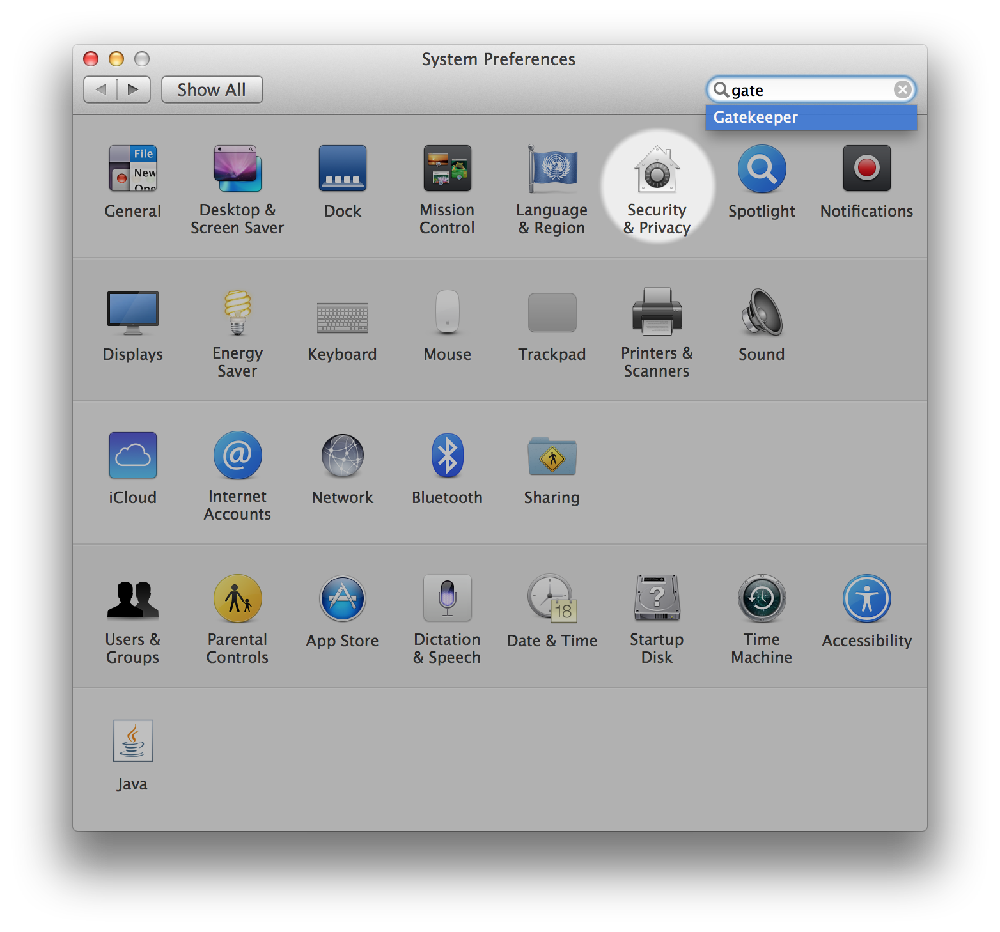
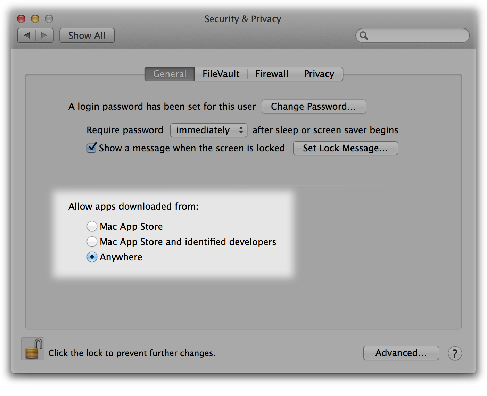

# Setting Up Your Programming Assignment Environment

The Machine Learning course includes several programming assignments which
you’ll need to finish to complete the course. The assignments require the
Octave or MATLAB scientific computing languages.

 - Octave is a free, open-source application available for many platforms. It
   has a text interface and an experimental graphical one.
 - MATLAB is proprietary software but a free, limited license is being offered
   for the completion of this course.

## FAQ

1. Does it cost money?

While you’re taking the course, both software packages are available free of
charge. Octave is distributed under the GNU Public License, which means that
it is always free to download and distribute. MATLAB licenses are available
for completing the programming assignments in the course only. For any other
purposes (like your own work after you complete the course), MATLAB can be
licensed to individuals or companies from Mathworks directly.

2. Is there a difference in quality?

There are several subtle differences between the two software packages. MATLAB
may offer a smoother experience (especially for Mac users), contains a larger
number of functions, and can be more robust to failure. However, the functions
used in this course are available in both packages, and many students have
successfully completed the course using either.

3. How do I install one of them?

See installation instructions for [Windows][win], [Mac OS X][osx] (10.10
Yosemite and 10.9 Mavericks), [other Mac OS X][mac], or [GNU/Linux][gnu].

## Installing MATLAB

MathWorks is providing you access to MATLAB for use in your coursework. When
planning your activity, please note that access is valid for the length of
the course (12 weeks).

Step 1: Enter your email to [create a MathWorks account][mat] if you do not
have one.

Step 2: Use this link again to [download and install][mat]. You may need to
log-in to your MathWorks account that you created in Step 1. After starting
the installer, accept all defaults and log-in to your MathWorks account when
prompted.

For additional resources, including an introduction to the MATLAB interface,
please see "More Octave/MATLAB Resources."

## Installing Octave on Windows

Use this link to [install Octave for windows][oct-win].

Octave on Windows can be used to submit programming assignments in this course
but will likely need a patch provided in the discussion forum. Refer to [this
discussion][oct-wpf] for more information about the patch for your version.

"Warning: Do not install Octave 4.0.0"; checkout the "Resources" menu's section
of "Installation Issues".

## Installing Octave on Mac OS X (10.10 Yosemite and 10.9 Mavericks)

Mac OS X has a feature called [Gatekeeper][gate] that may only let you install
applications from the Mac App Store. You may need to configure it to allow the
Octave installer. Visit your System Preferences, click Security & Privacy, and
check the setting to allow apps downloaded from Anywhere. You may need to enter
your password to unlock the settings page.

1. Download the [Octave 3.8.0 installer][380] or the latest version that isn't
   4.0.0. The file is large so this may take some time.

2. Open the downloaded image, probably named `GNU_Octave_3.8.0-6.dmg` on your
   computer, and then open `Octave-3.8.0-6.mpkg` inside.

3. Follow the installer's instructions. You may need to enter the
   administrator password for your computer.

4. After the installer completes, Octave should be installed on your computer.
   You can find `Octave-cli` in your Mac’s Applications, which is a text
   interface for Octave that you can use to complete Machine Learning's
   programming assignments.

Octave also includes an experimental graphical interface which is called
`Octave-gui`, also in your Mac’s Applications, but we recommend using
`Octave-cli` because it’s more stable.

Note: If you use a package manager (like MacPorts or Homebrew), we recommend
you follow the package manager [installation instructions][pac].

## Installing Octave on Mac OS X (10.8 Mountain Lion and Earlier)

If you use Mac OS X 10.9, we recommend following the instructions [above][osx].
For other Mac OS X versions, the Octave project doesn't distribute installers.
We recommend installing [Homebrew][brew], a package manager, using their
instructions.

"Warning: Do not install Octave 4.0.0"; checkout the "Resources" menu's section
of "Installation Issues".

## Installing Octave on GNU/Linux

We recommend using your [system package manager][spm] to install Octave.

On Ubuntu, you can use:

    sudo apt-get update && sudo apt-get install octave

On Fedora, you can use:

    sudo yum install octave-forge

Please consult [the Octave maintainer’s instructions][spm] for other GNU/Linux
systems.

"Warning: Do not install Octave 4.0.0"; checkout the "Resources" menu's section
of "Installation Issues".

[win]: https://www.coursera.org/learn/machine-learning/supplement/p9ckf/
[osx]: https://www.coursera.org/learn/machine-learning/supplement/ykU6M/
[mac]: https://www.coursera.org/learn/machine-learning/supplement/M16Qr/
[gnu]: https://www.coursera.org/learn/machine-learning/supplement/NSG5j/
[mat]: https://www.mathworks.com/licensecenter/classroom/machine_learning_od/
[oct-win]: http://wiki.octave.org/Octave_for_Microsoft_Windows
[oct-wpf]: https://www.coursera.org/learn/machine-learning/discussions/vgCyrQoMEeWv5yIAC00Eog?
[gate]: http://support.apple.com/en-us/HT202491
[380]: http://sourceforge.net/projects/octave/files/Octave%20MacOSX%20Binary/2013-12-30%20binary%20installer%20of%20Octave%203.8.0%20for%20OSX%2010.9.1%20%28beta%29/GNU_Octave_3.8.0-6.dmg/download
[pac]: http://wiki.octave.org/Octave_for_MacOS_X#Package_Managers
[brew]: http://wiki.octave.org/Octave_for_MacOS_X#Homebrew
[spm]: http://wiki.octave.org/Octave_for_GNU/Linux
