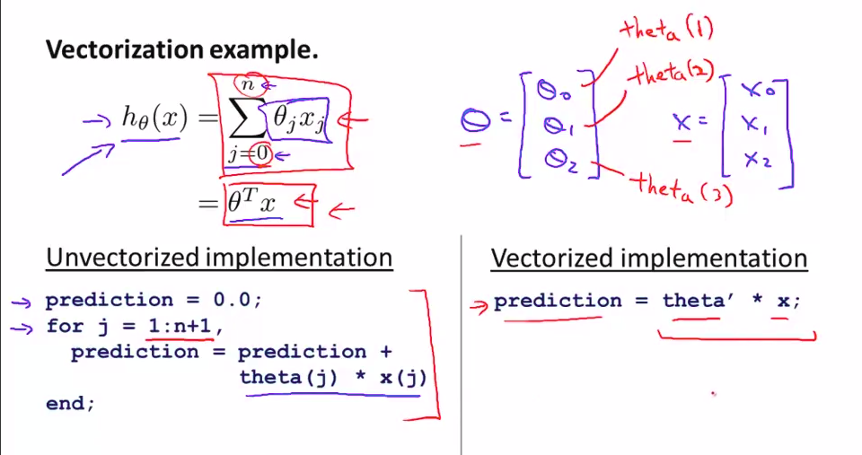
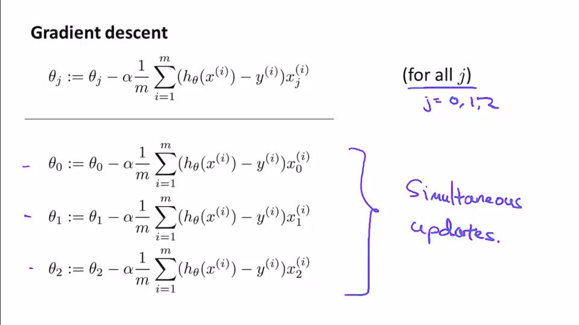

# Basics of Octave

Arithmetic operations are `+`,`-`,`/`,`*` as you would expect, and floating
point is always assumed (i.e. 1/2 = 0.500000, not 0). Equality is `==`, and the
test for inequality is `~=`.

Vectors can be created manually with

    w = [1 2 3]
    v = [1 2 3; 4 5 6]

where `w` is a row vector and `v` a 2 x 3 matrix.

Elements can be referenced by index, e.g. `v(1, 2) == 2`. Matrices can
also be sliced with `:`, the colon operator: `v(:, 2) == [2; 5]`.

The `:` operator can also be used to flatten a matrix into a single column, i.e.
`v(:) = [1;2;3;4;5;6]`.

Special vectors can also be created with

    i = eye(5)
    j = rand(1, 3)
    k = randn(1, 3)
    l = -10 + 3*randn(1, 3)

where `i` is the 5x5 identity matrix, `j` is a row vector with random values
between 0 and 1, and `k` is a row vector with random values from a Gaussian with
mean 0 and variance 1. `l` shifts the mean of `k` by -10 and multiplies the
variance by 3.

The dimensions of a matrix can be returned in a vector with the `size(j)`
command; if you used the `j` from before, `size(j) = [1 3]` is a 1x2 row vector.

# File Manipulation

Finding your way around the filesystem can be done with Unix/Linux commands:

    pwd % present working directory
    cd  % change directory
    ls  % list contents of current directory

Loading a data file, e.g. `priceY.dat`, can be done with `load`:

    load("priceY.dat") % uses priceY as the default variable name

Check that the variables are loaded correctly with `who`, or `whos` for more
detail.

    save test.mat priceY        % save priceY into test.mat (binary)
    save test.mat priceY -ascii % save priceY into test.mat (text file)

# More Operations

Scalar-vector arithmetic is mostly pretty intuitive too. Take `w = [1 2 3]`
from before:

    2 + w = [3 4 5]
    2 - w = [1 0 -1]
    2 * w = [2 4 6]

Except for division, `/`. That throws an error.

The scalar arithmetic operators work the same between matrices.
If you want an element-wise operation instead, add a dot `.` before:

    A = [1 1]   B = [2]   x = 3
                    [2]

    A * B = 4

    A + B' = [3 3]      % the apostrophe ' is a transpose operator

    B .* A = [2 2]
             [2 2]

Octave is pretty tolerant of errors, so it pads matrices instead of choking
whenever something doesn't make sense. This might be counterintuitive. For
example, using the above values:

    A + B = [3 3]
            [3 3]

So be careful if something doesn't quite look right.

`max` and `min` give the maximum or minimum of a row vector:

    max(w) = 3
    min(w) = 1

But for matrices, they work column-wise instead:

    max(A + B) = [3 3] % since the maximum in each column is 3

# Miscellaneous

Find out more about these.

    sum(A)
    prod(A)
    ceil()
    floor()
    flipud(A)
    magic(n)    % n x n magic square
    find()
    help()      % help gives you the documentation on a function

# Plotting graphics

Use the `plot()` function after defining an x-axis. First declare a range, e.g.
`-2 <= x <= 2`, in steps of 0.01:

    x = [-2:0.01:2];

Then decide on the function to plot, say `y = x^2 - 2*x + 1`:

    y = x^2 - 2*x + 1;

Finally, plot the function:

    plot(x, y);

To plot another function on the same axes, just issue the `hold on` command
first, then plot it, optionally specifying a colour, such as red (`r`):

    hold on;
    y2 = x^2;
    plot(x, y2, 'r');

It is possible to label axes with text by issuing `xlabel` or `ylabel` with the
string of choice, and write a `legend` to define the respective plots:

    xlabel("input values")
    ylabel("function output")
    legend("shifted", "original")

To clear the figure and start again, use `clf` before the next plot.

## Other plotting commands

Find out more about:

    imagesc()
    colorbar
    colormap
    subplot
    print

# Conditionals and loops: flow control

To execute a different action depending on the value of a variable, one uses an
`if` block, with an optional `else` or `elseif` to create other branches:

    if size > 100,
      disp("This is huge!")
    elseif size > 50,
      disp("It's pretty big.")
    else
      disp("OK, I can handle that.")

This prints a different sentence depending on the value of `size`.

A `for` loop with a bounded number of repetitions can be defined like so:

    for i = 1:10,
      disp(i);
    end;

But if there is a variable which holds the range, it can also be used, i.e.

    values = 1:10;
    for i = values,
      disp(i);
    end;

In the case of a `while` loop which operates as long as a condition is true, the
code looks quite similar:

    i = 0;
    while i < 10,
      i = i + 1;
      disp(i);
    end

This displays values of `i` as long as it is below 10, and increases the value
by 1 each time.

It may be necessary to `break` the execution of a loop for some reason, or skip
one iteration of that loop to `continue` on, in which case those keywords can be
used in the loops:

# Functions

Functions can be defined in separate files with the extension "`.m`". The first
is line of this file holds the return variable, the name of the function, and
its expected input, defined using the `function` keyword. Then the rest of the
file defines the body of the function.

    function y = cubeMe(x)

    y = x*x*x

Then running the function within octave is just a matter of invoking the name:

    cubeMe(7);  % this should return 343.

If the file is not saved where octave can find it, the function cannot run. One
workaround is to add the directory where the file is located to the search path:

    addpath("/home/user/most_functions/");

Now the function `cubeMe` can be run, assuming `cubeMe.m` is in that directory.

# Vectorization

Instead of looping through the summations needed in operations like gradient
descent or making predictions (`h_theta`), treating the code as vectors allows
one to come up with a more concise implementation.

Try to find variables in your equations that can be grouped as vectors.
