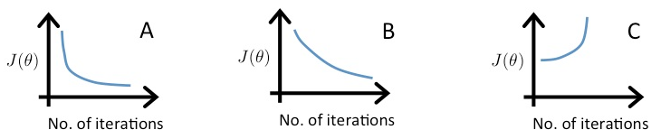

1. [Video 1][w2v1] at 3'24":

 | Size   | No. of   | No. of | Age of home | Price   |
 | (feet) | Bedrooms | Floors | (years)     | ($1000) |
 |--------|----------|--------|-------------|---------|
 |  2104  |    5     |    1   |      45     |   460   |
 |  1416  |    3     |    2   |      40     |   232   |
 |  1534  |    3     |    2   |      30     |   315   |
 |   852  |    2     |    1   |      36     |   178   |
 |  ...   |   ...    |  ...   |     ...     |   ...   |

In the training set above, what is `x^4_1`?

  a. The size (in feet^2) of the 1st home in the training set
  b. The age (in years) of the 1st home in the training set
  c. The size (in feet^2) of the 4th home in the training set
  d. The age (in years) of the 4th home in the training set

2. [Video 2][w2v2] at 1'21":

When there are `n` features, we define the cost function as

    J(theta) = 1/2m sum (i=1, m, (h_theta(x^i) - y(i))^2).

For linear regression, which of the following are also equivalent and correct
definitions of `J(theta)`?

  a.  J(θ) := θj−α1m∑i=1m(hθ(x(i))−y(i))⋅x(i)j
  b.  J(θ) := θj−α1m∑i=1m(hθ(x(i))−y(i))⋅x(i)j
  c.  J(θ) := θj−α1m∑i=1m(hθ(x(i))−y(i))⋅x(i)j
  d.  J(θ) := θj−α1m∑i=1m(hθ(x(i))−y(i))⋅x(i)j

3. [Video 3][w2v3] at 8'34":

Suppose you are using a learning algorithm to estimate the price of houses in a
city. You want one of your features `x_i` to capture the age of the house. In
your training set, all of your houses have an age between 30 and 50 years, with
an average age of 38 years. Which of the following would you use as features,
assuming you use feature scaling and mean normalization?

  a.  `x_i` = age of house
  b.  `x_i` = age of house / 50
  c.  `x_i` = (age of house - 38) / 50
  d.  `x_i` = (age of house - 38) / 20

4. [Video 4][w2v4] at 6'51":

Suppose a friend ran gradient descent three times, with `alpha` = 0.01, `alpha`
= 0.1, and `alpha` = 1, and got the following three plots (labeled A, B, and C):

Which plots correspond to which values of `alpha`?

  a.  A is `alpha` = 0.01, B is `alpha` = 0.1, C is `alpha` = 1.
  b.  A is `alpha` = 0.1, B is `alpha` = 0.01, C is `alpha` = 1.
  c.  A is `alpha` = 1, B is `alpha` = 0.01, C is `alpha` = 0.1.
  d.  A is `alpha` = 1, B is `alpha` = 0.1, C is `alpha` = 0.01.

5. [Video 5][w2v5] at 6'51":

Suppose you want to predict a house's price as a function of its size. Your
model is

    h_theta(x) = theta_0 + theta_1 * size + theta_2 * sqrt(size).

Suppose size ranges from 1 to 1000 (feet^2). You will implement this by fitting
a model

    h_theta(x) = theta_0 + theta_1 * x_1 + theta_2 * x_2.

Finally, suppose you want to use feature scaling (without mean normalization.)

Which of the following choices for `x_1` and `x_2` should you use? (Note: sqrt(1000) ~= 32.)

  a. `x_1` = size, `x_2` = 32 * sqrt(size)
  b. `x_1` = 32(size), `x_2` = sqrt(size)
  c. `x_1` = size / 1000, `x_2` = sqrt(size) / 32
  d. `x_1` = size / 32, `x_2` = 32 * sqrt(size)

6. [Video 5][w2v5] at 8'44":

Suppose you have the training in the table below (height in cm, weight in kg):

 |  age  | height | weight |
 | (x_1) | (x_2)  |  (x_3) |
 |-------|--------|--------|
 |    4  |   89   |   16   |
 |    9  |  124   |   28   |
 |    5  |  103   |   20   |

You would like to predict a child's weight as a function of his age and height
with the model

    weight = theta_0 + theta_1 * age + theta_2 * height

What are X and y?

         [4  89]      [16]
  a. X = [9 124], y = [28]
         [5 103]      [20]

         [1  4  89]      [1 16]
  b. X = [1  9 124], y = [1 28]
         [1  5 103]      [1 20]

         [4  89 1]      [16]
  c. X = [9 124 1], y = [28]
         [5 103 1]      [20]

         [1  4  89]      [16]
  d. X = [1  9 124], y = [28]
         [1  5 103]      [20]

[w2v1]: https://www.coursera.org/learn/machine-learning/lecture/6Nj1q/
[w2v2]: https://www.coursera.org/learn/machine-learning/lecture/Z9DKX/
[w2v3]: https://www.coursera.org/learn/machine-learning/lecture/xx3Da/
[w2v4]: https://www.coursera.org/learn/machine-learning/lecture/3iawu/
[w2v5]: https://www.coursera.org/learn/machine-learning/lecture/Rqgfz/
[w2v6]: https://www.coursera.org/learn/machine-learning/lecture/2DKxQ/
